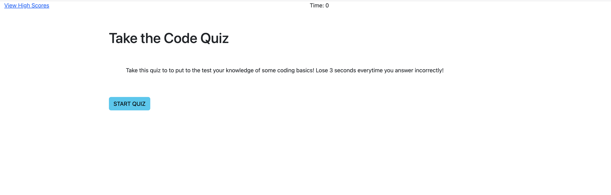

# Code Quiz
## A timed quiz testing knowledge of basic coding topics

1. This project was created to practice Javascript further.
2. It aids in understanding functions and event listeners. As well as testing basic knowledge of topics we have learned. 
3. This project allowed me to further understand topics we have practiced in our lessons. 

## Installation

+ GitHub repository and deployed weboage links are easily accesed via the following links:
    + https://github.com/priyanka-agrawal025/coding-quiz
    + https://priyanka-agrawal025.github.io/coding-quiz/

## Usage

+ Instructions:
    + Click the "START QUIZ" button to begin testing
    + Answer all questions and watch as the timer decrements
    + At the end of the quiz, enter your intials and watch as you enter the score-board for this test

## License

MIT License, available on GitHub repository
